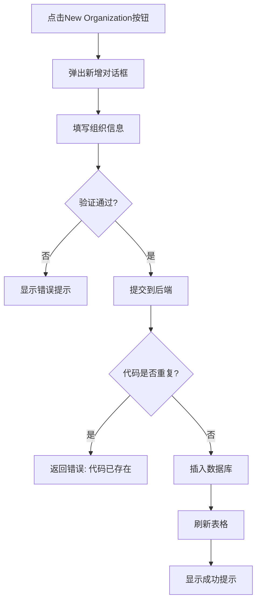
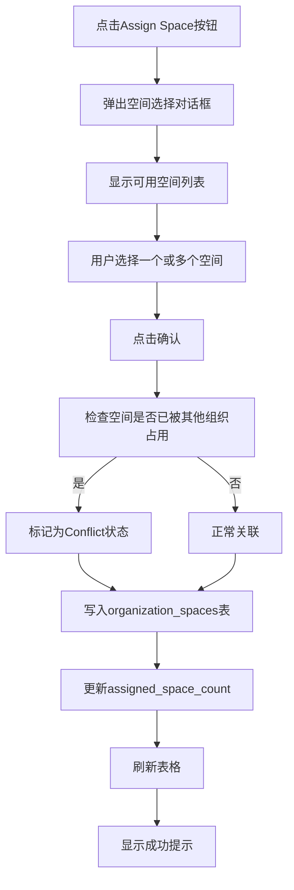
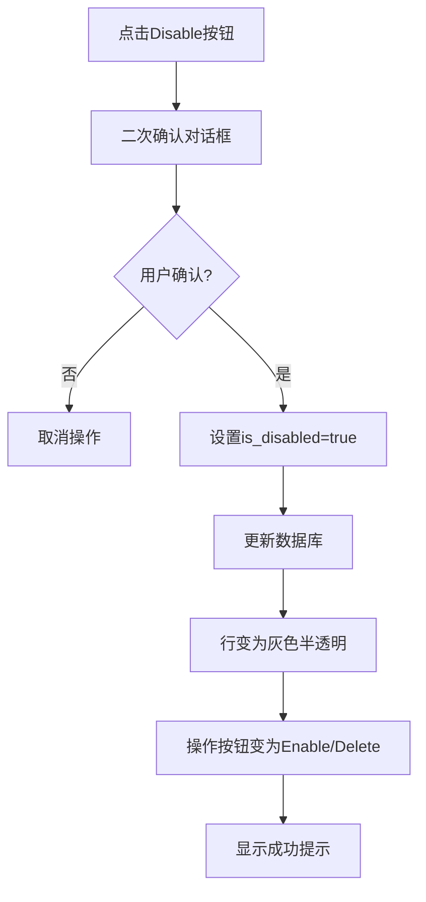
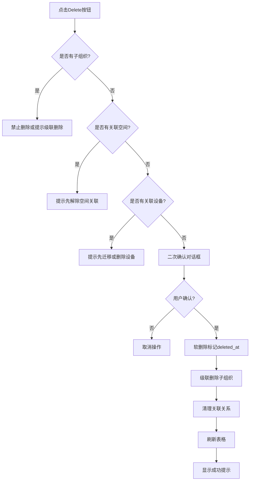

# 组织管理页面需求说明书（完整版）

## ⚠️ 重要说明

根据实际截图分析，本页面是**完整的CRUD管理页面**，具备以下特征：
- ✅ **新增按钮**："New Organization"
- ✅ **表格列表**：显示所有组织及其详细信息
- ✅ **操作列**：Assign Space、Disable、Delete
- ✅ **搜索框**：支持多字段搜索
- ✅ **统计信息**：节点总数 / 已分配空间数
- ✅ **树形结构**：层级展开/折叠

**注意**：当前HTML文件（organization-management.html）实际上是另一个**配置型页面**，用于编辑单个组织的详细参数。截图显示的是真正的管理列表页面。本文档基于截图描述完整的管理功能。

---

## 1. 页面概述

**组织管理（Organization Management）**是一个完整的CRUD管理页面，用于对校园内各类组织机构进行全生命周期的增删改查管理。

### 核心功能
- ✅ **新增组织**：创建新的组织节点
- ✅ **查看列表**：以表格形式展示所有组织及其详细信息
- ✅ **编辑组织**：修改组织属性、分配空间
- ✅ **删除/禁用组织**：移除或停用不再使用的组织
- ✅ **搜索过滤**：快速查找特定组织
- ✅ **层级展示**：树形结构展示组织关系

---

## 2. 页面布局

```
┌─────────────────────────────────────────────────────┐
│              顶部导航栏 (Top Bar)                     │
│  RunDo | System | Account | Benchmark | Organization | ... │
├─────────────────────────────────────────────────────┤
│                                                     │
│  ┌───────────────────────────────────────────────┐  │
│  │  统计区                                        │  │
│  │  6 ORGANIZATION NODES  /  3 SPACE ASSIGNED    │  │
│  │                           [+ New Organization] │  │
│  ├───────────────────────────────────────────────┤  │
│  │  搜索区                                        │  │
│  │  [🔍 Search organization name, code...]       │  │
│  ├───────────────────────────────────────────────┤  │
│  │  数据表格                                      │  │
│  │  ┌───┬──────────┬──────┬───────┬───────┬────┐ │  │
│  │  │▼  │ Org Name │ Code │ Level │ Count │... │ │  │
│  │  ├───┼──────────┼──────┼───────┼───────┼────┤ │  │
│  │  │ ▼ │ UTAR     │O-001 │ Univ  │   -   │... │ │  │
│  │  │   │ ▼ Faculty│O-010 │ Fac   │ 420   │... │ │  │
│  │  │   │   • Dept │O-011 │ Dept  │ 120   │... │ │  │
│  │  └───┴──────────┴──────┴───────┴───────┴────┘ │  │
│  └───────────────────────────────────────────────┘  │
└─────────────────────────────────────────────────────┘
```

---

## 3. 功能详细需求

### 3.1 统计信息区

**显示内容：**
- **组织节点总数**：例如 "6 ORGANIZATION NODES"
- **已分配空间数**：例如 "3 SPACE ASSIGNED"

**作用：**
- 快速了解当前系统中的组织规模
- 监控空间分配的完成情况

---

### 3.2 操作按钮区

#### 3.2.1 New Organization（新增组织）
**位置：** 右上角绿色按钮

**点击后行为：**
- 弹出新增组织对话框/模态框
- 表单字段包括：
  - 组织名称（必填）
  - 组织代码（必填，唯一）
  - 组织层级（University/Faculty/Department/Division）
  - 父级组织（下拉选择）
  - 负责人（可选）
  - 人数（可选）
  - 备注（可选）

**验证规则：**
- 组织代码不能重复
- 必须选择父级组织（根节点除外）
- 层级必须符合父子关系（如Faculty的父级必须是University）

---

### 3.3 搜索区

**搜索框：**
- Placeholder: "Search organization name, code, parent or owner"
- 支持模糊搜索
- 实时过滤表格数据

**搜索范围：**
- 组织名称
- 组织代码
- 父级组织名称
- 负责人姓名

**交互：**
- 输入时实时过滤
- 清空按钮清除搜索条件
- 无结果时显示空状态提示

---

### 3.4 数据表格

#### 3.4.1 表头字段

| 列名 | 说明 | 示例 |
|------|------|------|
| Organization Node | 组织名称（带展开箭头） | ▼ UTAR |
| Code | 组织代码 | O-001 |
| Level | 组织层级 | University/Faculty/Department/Division |
| Headcount | 人数 | 420 |
| Owner | 负责人 | Prof. Lee |
| Assigned Space | 已分配空间数 | 3 spaces |
| Allocation Status | 分配状态 | Normal / Allocation Conflict |
| Actions | 操作按钮 | Assign Space / Disable / Delete |

#### 3.4.2 树形展示

**层级缩进：**
- 根节点：无缩进
- 一级子节点：缩进20px
- 二级子节点：缩进40px
- 以此类推...

**展开/折叠：**
- 有子节点的行左侧显示 ▼/▶ 箭头
- 点击箭头展开/折叠子节点
- 默认展开第一层

**视觉区分：**
- 不同层级使用不同的图标或颜色
- 禁用的组织行呈灰色半透明

#### 3.4.3 状态标识

**Allocation Status（分配状态）：**
- **Normal（正常）**：绿色徽章，表示空间分配正常
- **Allocation Conflict（分配冲突）**：黄色/橙色徽章，表示存在空间分配问题
- **Disabled（已禁用）**：灰色徽章，表示组织已禁用

**显示逻辑：**
- 根据组织的空间分配情况自动计算
- 可能存在多个组织共享同一空间的冲突

---

### 3.5 操作列

每行右侧的操作按钮组：

#### 3.5.1 Assign Space / Continue Assign（分配空间）
**按钮样式：** 蓝色边框按钮

**功能：**
- 为该组织分配物理空间
- 如果已有部分分配，显示"Continue Assign"

**点击后行为：**
- 弹出空间选择对话框
- 显示可用空间列表（树形或表格）
- 支持多选
- 确认后建立组织-空间关联关系

**业务规则：**
- 一个组织可以关联多个空间
- 一个空间也可以被多个组织共享（但会产生Conflict状态）

#### 3.5.2 Disable / Enable（禁用/启用）
**按钮样式：** 深色按钮

**功能：**
- 禁用：停用该组织，但不删除数据
- 启用：重新激活已禁用的组织

**禁用后的影响：**
- 该行变为灰色半透明
- 操作按钮变为"Enable"和"Delete"
- 该组织下的设备、计量表等关联数据仍然保留
- 不影响历史数据统计

**启用条件：**
- 只有已禁用的组织才能启用
- 启用后恢复正常的操作按钮

#### 3.5.3 Delete（删除）
**按钮样式：** 深色按钮

**功能：**
- 永久删除该组织及其所有子组织

**删除前检查：**
- 是否有子组织？→ 禁止删除或提示级联删除
- 是否有关联的空间？→ 提示先解除关联
- 是否有关联的设备/计量表？→ 提示先迁移或删除

**二次确认：**
- 弹出确认对话框："Are you sure you want to delete this organization and all its children?"
- 显示将被删除的组织数量
- 用户确认后执行删除

**软删除 vs 硬删除：**
- 建议采用软删除（标记deleted_at字段）
- 保留历史记录用于审计

---

## 4. 数据结构设计

### 4.1 组织表（organizations）

```sql
CREATE TABLE organizations (
    id INT PRIMARY KEY AUTO_INCREMENT,
    code VARCHAR(20) UNIQUE NOT NULL COMMENT '组织代码',
    name VARCHAR(100) NOT NULL COMMENT '组织名称',
    level ENUM('University','Faculty','Department','Division') NOT NULL COMMENT '层级',
    parent_id INT DEFAULT NULL COMMENT '父级组织ID',
    headcount INT DEFAULT 0 COMMENT '人数',
    owner VARCHAR(50) DEFAULT NULL COMMENT '负责人',
    assigned_space_count INT DEFAULT 0 COMMENT '已分配空间数',
    allocation_status ENUM('Normal','Conflict','None') DEFAULT 'None' COMMENT '分配状态',
    is_disabled BOOLEAN DEFAULT FALSE COMMENT '是否禁用',
    created_at TIMESTAMP DEFAULT CURRENT_TIMESTAMP,
    updated_at TIMESTAMP DEFAULT CURRENT_TIMESTAMP ON UPDATE CURRENT_TIMESTAMP,
    deleted_at TIMESTAMP DEFAULT NULL COMMENT '软删除时间',
    
    FOREIGN KEY (parent_id) REFERENCES organizations(id)
);
```

### 4.2 组织-空间关联表（organization_spaces）

```sql
CREATE TABLE organization_spaces (
    id INT PRIMARY KEY AUTO_INCREMENT,
    organization_id INT NOT NULL,
    space_id INT NOT NULL,
    assigned_at TIMESTAMP DEFAULT CURRENT_TIMESTAMP,
    assigned_by VARCHAR(50) DEFAULT NULL,
    
    FOREIGN KEY (organization_id) REFERENCES organizations(id),
    FOREIGN KEY (space_id) REFERENCES spaces(id),
    UNIQUE KEY uk_org_space (organization_id, space_id)
);
```

---

## 5. 业务流程

### 5.1 新增组织流程



### 5.2 分配空间流程



### 5.3 禁用组织流程



### 5.4 删除组织流程



---

## 6. UI/UX设计规范

### 6.1 配色方案
- **主色调**：深蓝色背景 (#0f172a)
- **强调色**：绿色 (#22c55e) 用于新增按钮
- **状态色**：
  - 绿色徽章：Normal
  - 黄色/橙色徽章：Conflict
  - 灰色徽章：Disabled
- **文字色**：白色/浅灰色

### 6.2 交互细节
- **悬停效果**：行悬停时背景色变浅
- **展开动画**：子节点展开时有平滑过渡
- **加载状态**：异步操作显示loading spinner
- **错误提示**：红色Toast提示错误信息
- **成功提示**：绿色Toast提示操作成功

### 6.3 响应式设计
- **桌面端**：完整表格展示
- **平板端**：隐藏部分列，横向滚动
- **移动端**：卡片式展示，垂直堆叠

---

## 7. API接口设计

### 7.1 获取组织列表
```
GET /api/organizations?page=1&pageSize=20&search=&parentId=
Response:
{
  "code": 200,
  "data": {
    "total": 6,
    "list": [
      {
        "id": 1,
        "code": "O-001",
        "name": "UTAR",
        "level": "University",
        "parentId": null,
        "headcount": 0,
        "owner": "Board Office",
        "assignedSpaceCount": 0,
        "allocationStatus": "None",
        "isDisabled": false,
        "children": [...]
      }
    ]
  }
}
```

### 7.2 新增组织
```
POST /api/organizations
Body:
{
  "code": "O-012",
  "name": "Faculty of Science",
  "level": "Faculty",
  "parentId": 1,
  "headcount": 350,
  "owner": "Prof. Zhang"
}
```

### 7.3 更新组织
```
PUT /api/organizations/{id}
Body:
{
  "name": "Faculty of Computing",
  "headcount": 420,
  "owner": "Prof. Lee"
}
```

### 7.4 禁用/启用组织
```
PATCH /api/organizations/{id}/disable
Body: { "disabled": true }

PATCH /api/organizations/{id}/enable
Body: { "disabled": false }
```

### 7.5 删除组织
```
DELETE /api/organizations/{id}
```

### 7.6 分配空间
```
POST /api/organizations/{id}/spaces
Body:
{
  "spaceIds": [101, 102, 103]
}
```

### 7.7 解除空间关联
```
DELETE /api/organizations/{orgId}/spaces/{spaceId}
```

---

## 8. 测试要点

### 8.1 功能测试
- [ ] 新增组织（各种层级组合）
- [ ] 编辑组织信息
- [ ] 分配空间（单个/多个）
- [ ] 禁用/启用组织
- [ ] 删除组织（含子组织、含关联空间等场景）
- [ ] 搜索过滤
- [ ] 树形展开/折叠

### 8.2 边界测试
- [ ] 组织代码重复
- [ ] 循环引用（A的子节点是B，B的子节点是A）
- [ ] 删除根节点
- [ ] 超大层级深度（10层以上）
- [ ] 并发操作冲突

### 8.3 性能测试
- [ ] 1000+组织节点的加载速度
- [ ] 深层嵌套树的展开性能
- [ ] 搜索大量数据的响应时间

---

## 9. 注意事项

### 9.1 数据安全
- 删除操作必须有二次确认
- 敏感操作记录审计日志
- 基于角色的权限控制

### 9.2 用户体验
- 提供批量操作功能（未来扩展）
- 支持导入/导出Excel（未来扩展）
- 提供操作撤销功能（近期操作可回滚）

### 9.3 扩展性
- 预留自定义字段扩展能力
- 支持多租户隔离
- 支持国际化（中英文切换）

---

## 附录

### A. 术语表
- **Organization Node**：组织节点
- **Headcount**：人数
- **Assigned Space**：已分配空间
- **Allocation Conflict**：分配冲突（多个组织共享同一空间）
- **Soft Delete**：软删除（标记删除而非物理删除）

### B. 版本历史
| 版本 | 日期 | 作者 | 变更说明 |
|------|------|------|----------|
| v1.0 | 2026-04-15 | System Analyst | 初始版本，基于截图分析 |
