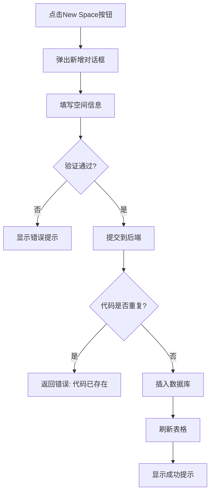
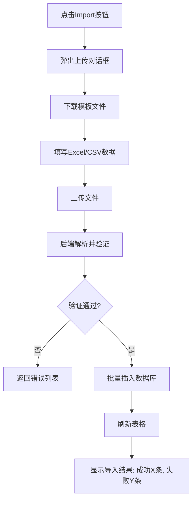
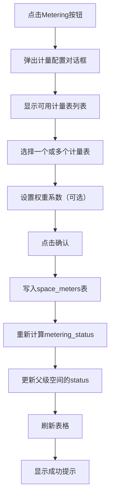
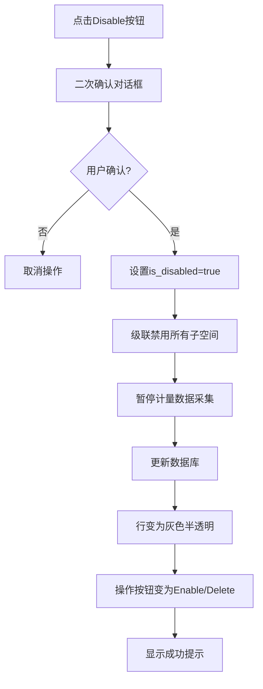
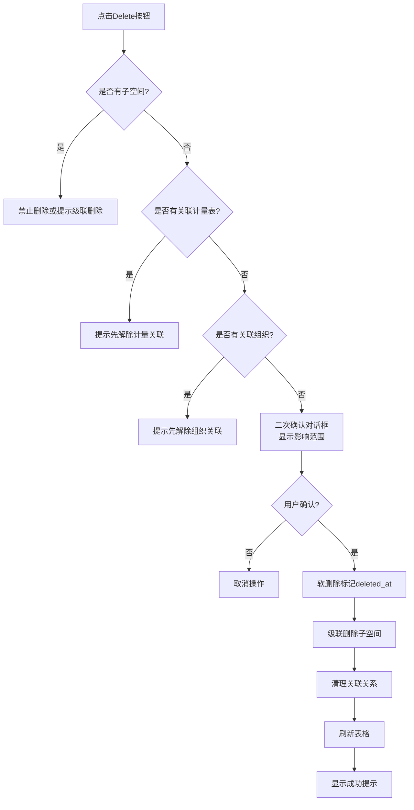

# 空间管理页面需求说明书（完整版）

## ⚠️ 重要说明

根据实际截图分析，本页面是**完整的CRUD管理页面**，具备以下特征：
- ✅ **新增按钮**："New Space"
- ✅ **导入按钮**："Import"（批量导入Excel/CSV）
- ✅ **表格列表**：显示所有空间及其详细信息
- ✅ **操作列**：Metering、Disable、Delete
- ✅ **搜索框**：支持多字段搜索
- ✅ **统计信息**：节点总数 / 计量就绪数
- ✅ **树形结构**：层级展开/折叠（Campus → Building → Floor → Room）

**注意**：当前HTML文件（space-management.html）实际上是另一个**配置型页面**，用于编辑单个空间的详细参数。截图显示的是真正的管理列表页面。本文档基于截图描述完整的管理功能。

---

## 1. 页面概述

**空间管理（Space Management）**是一个完整的CRUD管理页面，用于对校园内各类物理空间进行全生命周期的增删改查管理。

### 核心功能
- ✅ **新增空间**：创建新的空间节点
- ✅ **导入空间**：批量导入空间数据（Excel/CSV）
- ✅ **查看列表**：以表格形式展示所有空间及其详细信息
- ✅ **编辑空间**：修改空间属性、配置计量
- ✅ **删除/禁用空间**：移除或停用不再使用的空间
- ✅ **搜索过滤**：快速查找特定空间
- ✅ **层级展示**：树形结构展示空间关系（Campus → Building → Floor → Room）

---

## 2. 页面布局

```
┌─────────────────────────────────────────────────────┐
│              顶部导航栏 (Top Bar)                     │
│  RunDo | System | Account | Benchmark | Space | ...  │
├─────────────────────────────────────────────────────┤
│                                                     │
│  ┌───────────────────────────────────────────────┐  │
│  │  统计区                                        │  │
│  │  11 SPACE NODES  /  4 METERING READY          │  │
│  │                    [↑ Import] [+ New Space]   │  │
│  ├───────────────────────────────────────────────┤  │
│  │  搜索区                                        │  │
│  │  [🔍 Search space name, code, parent...]      │  │
│  ├───────────────────────────────────────────────┤  │
│  │  数据表格                                      │  │
│  │  ┌───┬──────────┬──────┬───────┬───────┬────┐ │  │
│  │  │▼  │ Space    │ Code │ Level │ Area  │... │ │  │
│  │  ├───┼──────────┼──────┼───────┼───────┼────┤ │  │
│  │  │ ▼ │ Campus   │S-001 │Campus │   -   │... │ │  │
│  │  │   │ ▼ Block  │S-010 │Build  │12500  │... │ │  │
│  │  │   │   • 1F   │S-011 │Floor  │ 2400  │... │ │  │
│  │  └───┴──────────┴──────┴───────┴───────┴────┘ │  │
│  └───────────────────────────────────────────────┘  │
└─────────────────────────────────────────────────────┘
```

---

## 3. 功能详细需求

### 3.1 统计信息区

**显示内容：**
- **空间节点总数**：例如 "11 SPACE NODES"
- **计量就绪数**：例如 "4 METERING READY"

**作用：**
- 快速了解当前系统中的空间规模
- 监控计量配置的完成情况

---

### 3.2 操作按钮区

#### 3.2.1 Import（导入）
**位置：** 右上角白色边框按钮

**功能：**
- 批量导入空间数据
- 支持Excel (.xlsx) 和 CSV (.csv) 格式

**点击后行为：**
- 弹出文件上传对话框
- 提供模板下载链接
- 上传后进行数据验证
- 显示导入结果（成功/失败数量）
- 失败时提供错误详情下载

**模板格式：**
```
Code,Name,Level,Parent_Code,Area,Usage,Remarks
S-001,UTAR Campus,Campus,,,-,Main campus
S-010,Block FA,Building,S-001,12500,Teaching,
S-011,FA-1F,Floor,S-010,2400,Utility,
```

**验证规则：**
- Code不能重复
- Parent_Code必须存在
- Level必须符合父子关系
- Area必须为正数

#### 3.2.2 New Space（新增空间）
**位置：** 右上角绿色按钮

**点击后行为：**
- 弹出新增空间对话框/模态框
- 表单字段包括：
  - 空间名称（必填）
  - 空间代码（必填，唯一）
  - 空间层级（Campus/Building/Floor/Room/Equipment_Room）
  - 父级空间（下拉选择）
  - 面积 m²（必填，正数）
  - 用途（下拉选择：Teaching/Office/Lab/Utility/Dormitory等）
  - 备注（可选）

**验证规则：**
- 空间代码不能重复
- 必须选择父级空间（根节点除外）
- 层级必须符合父子关系（如Floor的父级必须是Building）
- 面积必须大于0

---

### 3.3 搜索区

**搜索框：**
- Placeholder: "Search space name, code, parent or usage"
- 支持模糊搜索
- 实时过滤表格数据

**搜索范围：**
- 空间名称
- 空间代码
- 父级空间名称
- 用途

**交互：**
- 输入时实时过滤
- 清空按钮清除搜索条件
- 无结果时显示空状态提示

---

### 3.4 数据表格

#### 3.4.1 表头字段

| 列名 | 说明 | 示例 |
|------|------|------|
| Space Node | 空间名称（带展开箭头） | ▼ UTAR Campus |
| Code | 空间代码 | S-001 |
| Level | 空间层级 | Campus/Building/Floor/Room |
| Area m² | 面积（平方米） | 12,500 |
| Usage | 用途 | Teaching/Office/Lab/Utility |
| Metering Status | 计量状态 | Configured / Partially Configured / Unconfigured |
| Actions | 操作按钮 | Metering / Disable / Delete |

#### 3.4.2 树形展示

**层级结构：**
```
Campus（校区）
├── Building（建筑）
│   ├── Floor（楼层）
│   │   ├── Room（房间）
│   │   └── Equipment_Room（设备间）
│   └── ...
└── ...
```

**层级缩进：**
- 根节点（Campus）：无缩进
- 一级子节点（Building）：缩进20px
- 二级子节点（Floor）：缩进40px
- 三级子节点（Room）：缩进60px
- 以此类推...

**展开/折叠：**
- 有子节点的行左侧显示 ▼/▶ 箭头
- 点击箭头展开/折叠子节点
- 默认展开第一层

**视觉区分：**
- 不同层级可使用不同的图标
- 禁用的空间行呈灰色半透明

#### 3.4.3 计量状态（Metering Status）

**状态类型：**
- **Configured（已配置）**：绿色徽章，表示该空间及所有子空间都已配置计量
- **Partially Configured（部分配置）**：黄色/橙色徽章，表示部分子空间已配置计量
- **Unconfigured（未配置）**：红色徽章，表示该空间及所有子空间都未配置计量
- **Includes Virtual Meter（包含虚拟表）**：紫色徽章，表示使用了虚拟计量表
- **Disabled（已禁用）**：灰色徽章，表示空间已禁用

**计算逻辑：**
```
if 所有子空间都已配置 then Configured
else if 部分子空间已配置 then Partially Configured
else Unconfigured
```

---

### 3.5 操作列

每行右侧的操作按钮组：

#### 3.5.1 Metering（计量配置）
**按钮样式：** 蓝色边框按钮

**功能：**
- 为该空间配置计量表
- 关联物理电表或创建虚拟表

**点击后行为：**
- 弹出计量配置对话框
- 显示可用计量表列表
- 支持选择多个计量表
- 可设置权重系数（如果一个空间有多个表）
- 确认后建立空间-计量表关联关系

**业务规则：**
- 一个空间可以关联多个计量表
- 一个计量表只能属于一个空间（除非是虚拟表）
- 配置计量后自动更新Metering Status

#### 3.5.2 Disable / Enable（禁用/启用）
**按钮样式：** 深色按钮

**功能：**
- 禁用：停用该空间，但不删除数据
- 启用：重新激活已禁用的空间

**禁用后的影响：**
- 该行变为灰色半透明
- 操作按钮变为"Enable"和"Delete"
- 该空间下的子空间也被禁用
- 关联的计量表读数停止采集
- 不影响历史数据统计

**启用条件：**
- 只有已禁用的空间才能启用
- 启用后恢复正常的操作按钮

#### 3.5.3 Delete（删除）
**按钮样式：** 深色按钮

**功能：**
- 永久删除该空间及其所有子空间

**删除前检查：**
- 是否有子空间？→ 禁止删除或提示级联删除
- 是否有关联的计量表？→ 提示先解除关联
- 是否有关联的组织？→ 提示先解除组织关联
- 是否有能耗数据？→ 警告将丢失历史数据

**二次确认：**
- 弹出确认对话框："Are you sure you want to delete this space and all its children?"
- 显示将被删除的空间数量和影响的计量表数量
- 用户确认后执行删除

**软删除 vs 硬删除：**
- 建议采用软删除（标记deleted_at字段）
- 保留历史记录用于审计和数据追溯

---

## 4. 数据结构设计

### 4.1 空间表（spaces）

```sql
CREATE TABLE spaces (
    id INT PRIMARY KEY AUTO_INCREMENT,
    code VARCHAR(20) UNIQUE NOT NULL COMMENT '空间代码',
    name VARCHAR(100) NOT NULL COMMENT '空间名称',
    level ENUM('Campus','Building','Floor','Room','Equipment_Room') NOT NULL COMMENT '层级',
    parent_id INT DEFAULT NULL COMMENT '父级空间ID',
    area DECIMAL(10,2) DEFAULT NULL COMMENT '面积(m²)',
    usage VARCHAR(50) DEFAULT NULL COMMENT '用途',
    metering_status ENUM('Configured','Partial','Unconfigured','Virtual','None') DEFAULT 'None' COMMENT '计量状态',
    is_disabled BOOLEAN DEFAULT FALSE COMMENT '是否禁用',
    created_at TIMESTAMP DEFAULT CURRENT_TIMESTAMP,
    updated_at TIMESTAMP DEFAULT CURRENT_TIMESTAMP ON UPDATE CURRENT_TIMESTAMP,
    deleted_at TIMESTAMP DEFAULT NULL COMMENT '软删除时间',
    
    FOREIGN KEY (parent_id) REFERENCES spaces(id),
    INDEX idx_level (level),
    INDEX idx_usage (usage)
);
```

### 4.2 空间-计量表关联表（space_meters）

```sql
CREATE TABLE space_meters (
    id INT PRIMARY KEY AUTO_INCREMENT,
    space_id INT NOT NULL,
    meter_id INT NOT NULL,
    weight DECIMAL(5,2) DEFAULT 1.00 COMMENT '权重系数',
    assigned_at TIMESTAMP DEFAULT CURRENT_TIMESTAMP,
    assigned_by VARCHAR(50) DEFAULT NULL,
    
    FOREIGN KEY (space_id) REFERENCES spaces(id),
    FOREIGN KEY (meter_id) REFERENCES meters(id),
    UNIQUE KEY uk_space_meter (space_id, meter_id)
);
```

### 4.3 组织-空间关联表（organization_spaces）

```sql
CREATE TABLE organization_spaces (
    id INT PRIMARY KEY AUTO_INCREMENT,
    organization_id INT NOT NULL,
    space_id INT NOT NULL,
    assigned_at TIMESTAMP DEFAULT CURRENT_TIMESTAMP,
    assigned_by VARCHAR(50) DEFAULT NULL,
    
    FOREIGN KEY (organization_id) REFERENCES organizations(id),
    FOREIGN KEY (space_id) REFERENCES spaces(id),
    UNIQUE KEY uk_org_space (organization_id, space_id)
);
```

---

## 5. 业务流程

### 5.1 新增空间流程



### 5.2 导入空间流程



### 5.3 配置计量流程



### 5.4 禁用空间流程



### 5.5 删除空间流程



---

## 6. UI/UX设计规范

### 6.1 配色方案
- **主色调**：深蓝色背景 (#0f172a)
- **强调色**：绿色 (#22c55e) 用于新增按钮
- **状态色**：
  - 绿色徽章：Configured
  - 黄色/橙色徽章：Partially Configured
  - 红色徽章：Unconfigured
  - 紫色徽章：Includes Virtual Meter
  - 灰色徽章：Disabled
- **文字色**：白色/浅灰色

### 6.2 交互细节
- **悬停效果**：行悬停时背景色变浅
- **展开动画**：子节点展开时有平滑过渡（0.3s ease）
- **加载状态**：异步操作显示loading spinner
- **错误提示**：红色Toast提示错误信息
- **成功提示**：绿色Toast提示操作成功
- **导入进度**：大文件导入显示进度条

### 6.3 响应式设计
- **桌面端（≥1200px）**：完整表格展示
- **平板端（768px-1199px）**：隐藏部分列，横向滚动
- **移动端（<768px）**：卡片式展示，垂直堆叠

---

## 7. API接口设计

### 7.1 获取空间列表
```
GET /api/spaces?page=1&pageSize=20&search=&parentId=
Response:
{
  "code": 200,
  "data": {
    "total": 11,
    "list": [
      {
        "id": 1,
        "code": "S-001",
        "name": "UTAR Campus",
        "level": "Campus",
        "parentId": null,
        "area": null,
        "usage": null,
        "meteringStatus": "Configured",
        "isDisabled": false,
        "children": [...]
      }
    ]
  }
}
```

### 7.2 新增空间
```
POST /api/spaces
Body:
{
  "code": "S-016",
  "name": "FB-5F",
  "level": "Floor",
  "parentId": 2,
  "area": 2500,
  "usage": "Office"
}
```

### 7.3 更新空间
```
PUT /api/spaces/{id}
Body:
{
  "name": "Block FA",
  "area": 12500,
  "usage": "Teaching"
}
```

### 7.4 禁用/启用空间
```
PATCH /api/spaces/{id}/disable
Body: { "disabled": true }

PATCH /api/spaces/{id}/enable
Body: { "disabled": false }
```

### 7.5 删除空间
```
DELETE /api/spaces/{id}
```

### 7.6 导入空间
```
POST /api/spaces/import
Content-Type: multipart/form-data
Body: file=<excel_or_csv_file>

Response:
{
  "code": 200,
  "data": {
    "successCount": 10,
    "failureCount": 2,
    "errors": [
      {"row": 3, "message": "Duplicate code: S-011"},
      {"row": 5, "message": "Invalid parent_code: S-999"}
    ]
  }
}
```

### 7.7 下载导入模板
```
GET /api/spaces/template
Response: Excel file download
```

### 7.8 配置计量
```
POST /api/spaces/{id}/meters
Body:
{
  "meterIds": [201, 202],
  "weights": [1.0, 0.5]
}
```

### 7.9 解除计量关联
```
DELETE /api/spaces/{spaceId}/meters/{meterId}
```

---

## 8. 测试要点

### 8.1 功能测试
- [ ] 新增空间（各种层级组合）
- [ ] 编辑空间信息
- [ ] 导入空间（Excel/CSV）
- [ ] 配置计量（单个/多个）
- [ ] 禁用/启用空间
- [ ] 删除空间（含子空间、含关联计量等场景）
- [ ] 搜索过滤
- [ ] 树形展开/折叠

### 8.2 边界测试
- [ ] 空间代码重复
- [ ] 循环引用（A的子节点是B，B的子节点是A）
- [ ] 删除根节点（Campus）
- [ ] 超大层级深度（10层以上）
- [ ] 并发操作冲突
- [ ] 导入超大文件（10000+行）
- [ ] 面积为0或负数
- [ ] 非法的父级关系

### 8.3 性能测试
- [ ] 10000+空间节点的加载速度
- [ ] 深层嵌套树的展开性能
- [ ] 搜索大量数据的响应时间
- [ ] 批量导入的性能（1000条/秒）

### 8.4 兼容性测试
- [ ] Excel文件格式（.xlsx, .xls）
- [ ] CSV文件编码（UTF-8, GBK）
- [ ] 不同浏览器的表现

---

## 9. 注意事项

### 9.1 数据安全
- 删除操作必须有二次确认
- 敏感操作记录审计日志
- 基于角色的权限控制
- 导入文件病毒扫描

### 9.2 用户体验
- 提供操作撤销功能（近期操作可回滚）
- 导入时显示详细错误信息
- 支持批量编辑（未来扩展）
- 提供空间拓扑图可视化（未来扩展）

### 9.3 扩展性
- 预留自定义字段扩展能力
- 支持多租户隔离
- 支持国际化（中英文切换）
- 支持与BIM系统集成（未来扩展）

### 9.4 计量状态计算优化
- 使用缓存避免频繁计算
- 增量更新而非全量重算
- 异步任务处理大批量更新

---

## 附录

### A. 术语表
- **Space Node**：空间节点
- **Metering Ready**：计量就绪
- **Configured**：已配置（所有子空间都有计量）
- **Partially Configured**：部分配置（部分子空间有计量）
- **Unconfigured**：未配置（没有子空间有计量）
- **Virtual Meter**：虚拟计量表（通过算法计算的假想表）
- **Soft Delete**：软删除（标记删除而非物理删除）

### B. 空间层级说明
| 层级 | 英文 | 说明 | 示例 |
|------|------|------|------|
| 校区 | Campus | 最高层级，代表整个校园 | UTAR Campus |
| 建筑 | Building | 独立的建筑物 | Block FA, Library |
| 楼层 | Floor | 建筑物的某一层 | FA-1F, FA-2F |
| 房间 | Room | 楼层内的具体房间 | 101教室, 办公室 |
| 设备间 | Equipment_Room | 放置机电设备的空间 | 配电室, 空调机房 |

### C. 用途类型
- Teaching（教学）
- Office（办公）
- Lab（实验室）
- Utility（公共设施）
- Dormitory（宿舍）
- Library（图书馆）
- Sports（体育设施）
- Other（其他）

### D. 版本历史
| 版本 | 日期 | 作者 | 变更说明 |
|------|------|------|----------|
| v1.0 | 2026-04-15 | System Analyst | 初始版本，基于截图分析 |
